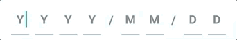
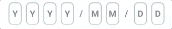
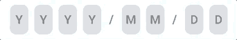

# react-native-character-input


[](https://www.npmjs.com/package/react-native-character-input)
[](https://www.npmjs.com/package/react-native-character-input)
[](https://github.com/hrutvikk/react-native-character-input/issues)
[](https://github.com/hrutvikk/react-native-character-input/issues?q=is%3Aissue+is%3Aclosed)

-----

## Getting started

`$ npm install react-native-character-input --save`

## Import
`import CharacterInput from 'react-native-character-input'`

## Usage



```javascript
<CharacterInput
	placeHolder='YYYY/MM/DD'
	showCharBinary='1111011011'
	handleChange={(value) => setValue(value)}
	inputType='underlined'
	keyboardType='numeric'
/>
```



```javascript
<CharacterInput
	placeHolder='YYYY/MM/DD'
	showCharBinary='1111011011'
	handleChange={(value) => setValue(value)}
	inputType='outlined'
	keyboardType='numeric'
/>
```



```javascript
<CharacterInput
	placeHolder='YYYY/MM/DD'
	showCharBinary='1111011011'
	handleChange={(value) => setValue(value)}
	inputType='contained'
	keyboardType='numeric'
/>
```
## Available Props
| Name              | Type                                                                                  | Required?                                   | Description                                                                                 |
|-------------------|---------------------------------------------------------------------------------------|--------------------------------------------|---------------------------------------------------------------------------------------------|
| placeHolder       | string                                                                                | yes                                   | String of place holder characters.                                                             |
| showCharBinary            | string                                                                                | yes                                   | String of `1` or `0`, indicates if corresponding character should be editable or not                                                         |
| handleChange      | function(value: string) => void                                                                             | yes                                   | Returns a string of modifiable characters (1) stripped of disabled characters (0).                                                                 |
| keyboardType			| string | no | Same as `TextInput` component from react-native |
| inputType | string | no | Default `underlined`, Options include: `underlined`, `outlined`, and `contained`
| permanentTextStyle | StyleSheet | no | Styles `Text` component of disabled characters |
| containerStyle | StyleSheet | no | Contained style of each character input
| inputStyle | StyleSheet | no | Input style of each character input |
| inputContainerStyle | StyleSheet | no | Input container style of each character input |
| placeHolderTextColor | StyleSheet | no | Place holder text color |

## Features to come
1) handleChange function will return both stripped and raw input values(both modifiable and disabled characters).
2) Allow masked character inputs.
	- Will implement a way to specify an object of keys to REGEX values. 
	- This will allow you to specify a mask string of keys/permenant characters. Permenant characters are not mapped as keys and keys have an associated REGEX as its rule to change the character input value.
	- This one will take me awhile :)


